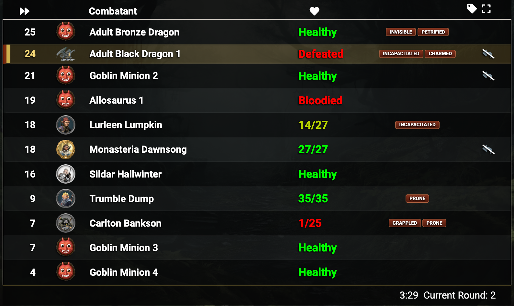

# Improved Initiative — Custom Dark Player View Theme

A custom CSS theme for the Player View in [Improved Initiative](https://www.improvedinitiative.app/) — the free, open-source D&D 5e combat tracker. Designed for TV display, OBS streaming, and laptop play, with a stable 6-column grid layout, high-contrast HP colours, and a clean dark aesthetic.

---

## What this is

Improved Initiative has a built-in **Player View** — a separate browser window or URL you can show to your players (or capture in OBS). By default its layout breaks at larger viewport widths. This theme:

- Forces a stable 6-column grid at all viewport widths up to ~1000px
- Shows combatant portraits, condition tags, and a reaction tracker in the correct columns
- Displays a 👹 emoji placeholder for monsters without a portrait image
- Makes HP colours (Healthy / partial / Defeated) vivid and readable on a dark background
- Keeps header icons (tag 🏷 and fullscreen ⛶) in-line with the header row
- Suppresses the red divider line the app draws between combatants

---

## How to install

1. Open [improvedinitiative.app](https://www.improvedinitiative.app/) and load your encounter.
2. Click the **gear icon** (⚙ Settings) in the top-right.
3. Scroll down to **Custom CSS**.
4. Open `Additional Player View.css` from this repo and copy the entire raw contents (see below).
5. Paste it into the Custom CSS box.
6. Click **Save**. The Player View updates immediately — no reload needed.

### Getting the raw CSS text

- **On GitHub:** open `Additional Player View.css`, then click the **Raw** button. Select all (`Ctrl+A` / `Cmd+A`) and copy.
- **Locally:** open the file in any text editor, select all, copy.

The only file you need is `Additional Player View.css`. Everything else in this repo is a local preview tool.

---

## Quick-tune settings

All the values you are likely to want to change are CSS variables at the **very top of the file** (Section 1, `#playerview { ... }`). You do not need to touch anything else.

| Variable | Default | What it controls |
|---|---|---|
| `--panel-max-width` | `1050px` | Maximum width of the tracker panel |
| `--panel-width` | `80%` | Panel width as a % of the viewport |
| `--row-height` | `1rem` | Height of each combatant row |
| `--header-height` | `2rem` | Height of the column-header row |
| `font-size` | `15px` | Base font size — scales everything proportionally |
| `--col-init` | `3rem` | Initiative column width |
| `--col-portrait` | `3rem` | Portrait column width |
| `--col-hp` | `7rem` | HP column width |
| `--col-tags` | `10rem` | Condition tags column width |
| `--col-reaction` | `2.5rem` | Reaction tracker column width |
| `--hp-brightness` | `2.2` | Brightness multiplier for HP text colours |
| `--hp-saturate` | `2.5` | Saturation multiplier for HP text colours |
| `--panel-bg` | `rgba(5,8,8,0.48)` | Panel background (supports transparency) |
| `--header-bg` | `rgba(5,5,5,0.82)` | Header row background |

---

## Using with OBS

The Player View is a browser source you can capture directly in OBS using the Player View URL shown in Improved Initiative's settings page.

### Keep the OBS browser source width at 1000 px or less

Improved Initiative's own stylesheet includes a `@media (min-width: 1000px)` block that re-applies absolute positioning to portrait images and condition tags. This theme overrides that behaviour, but only reliably at widths up to 1000 px.

**Known issue — large viewport widths (work in progress):**
If the OBS browser source or the browser window is scaled wider than ~1000 px, the layout can still break: portrait images and condition tags may float out of their grid columns. Until this is fully resolved, keep your capture width at or below 1000 px.

Recommended OBS browser source settings:

| Setting | Value |
|---|---|
| Width | **1000 px** (do not exceed) |
| Height | 600–800 px (to taste) |
| URL | Player View URL from Improved Initiative settings |

---

## File reference

| File | Purpose |
|---|---|
| `Additional Player View.css` | **The only file you need — paste this into Improved Initiative** |
| `index.html` | Local preview demo — mirrors the real app's HTML so you can test CSS changes without opening the live app |

---

## How the layout works

The theme imposes a 6-column CSS Grid on every combatant row:

| Col 1 | Col 2 | Col 3 | Col 4 | Col 5 | Col 6 |
|---|---|---|---|---|---|
| Initiative | Portrait | Name | HP | Condition tags | Reaction |
| `3rem` | `3rem` | `1fr` (flexible) | `7rem` | `10rem` | `2.5rem` |

The header row uses the same grid. The 🏷 (tag editor) and ⛶ (fullscreen toggle) icons are pinned to the right edge of the header using controlled absolute positioning scoped to the header's own coordinate space.

HP colours come from inline styles set by the Improved Initiative app based on HP percentage. The theme applies `saturate()` then `brightness()` CSS filters to make those colours readable against the dark background without changing their hue — green stays green, red stays red, and the dark olive used for partial HP becomes a bright amber.

Specificity wars with the app's own CSS are resolved using a two-ID selector trick (`#playerview:not(#_)`) that raises selector weight to (2, n, 0) without requiring `inline` styles, letting the theme win all conflicts while remaining patchable.

---

## Credits

Theme built against [Improved Initiative](https://www.improvedinitiative.app/) by E.R. Burgess.
